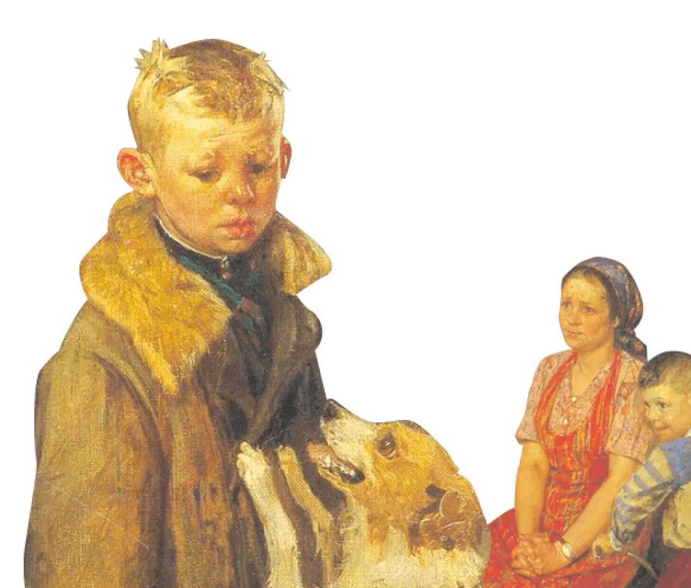

# Научиться учиться


***
**Описание проекта:** одностраничный сайт от [**Яндекс.Практикум**](https://practicum.yandex.ru/) с графическим оформлением и анимациями, описывающий, в чем проблемы современного подхода к образованию и какие существуют пути их решения.
Сайт содержит следующие **секции:**

**1.** Шапка сайта с загловком, ссылкой, иллюстрацией и применением анимации.

**2.** **Главные проблемы** в обучении в одноименной секции.

**3.** **Техники обучения** от Барбары Оакли: 5 возможных техник, оформленных в однотипные карточки
с иллюстрацией, названием и кратким описанием.

**4.** **Видео на TED.** Ознакомительные видео (реализации с помощью iframe):
  - Что творится в голове у заядлого прокрастинатора
  - Как обучится чему угодно?

**5.** Секция **Метод Фейнмана** с иллюстрацией и ссылкой для подробного ознакомления.

**6.** Секция **Цифры и факты**: занимательные тезисы о работе мозга и процессе учебы.

**7.** Секция с иллюстрацией обложки и ссылкой для покупки книги, посвященной тематике сайта.


**8.** **Принципы обучения от Джона Кауфмана** с анимацией.

**9.** Секция **Полезные ресурсы** с оформленными логотипами ссылками на познвательные порталы для самообразования:

[](https://arzamas.academy/)

[](https://nplus1.ru/)

[]()

[](https://polka.academy/)

**10.** Секция с ссылками для ознакомления с платформой **Яндекс.Практикум**.


Сайт реализован с помощью **HTML** и **СSS**

```
<header class="header">
  
  <h1 class="header__title">Научиться учиться</h1>
  <p class="header__subtitle"> Какие современные и эффективные подходы к обучению   вы можете использовать в своей жизни?
    <a href="#" class="header__link">Узнать &rarr;</a>
  </p>
  <div class="header__square-pic rotation"></div>
  
</header>
```

